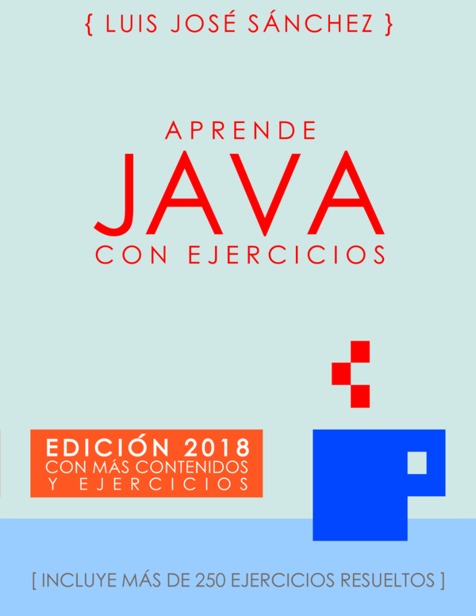

# ejercicios-de-java

Ejercicios de la asignatura Programación de 1º DAM del IES Campanillas.

## :books: Bibliografía

[Aprende Java con Ejercicios](https://leanpub.com/aprendejava)

## Enlaces de interés

* [Página oficial del IES Campanillas](http://iescampanillas.com/)

* [Guia de la asignatura Programación](https://github.com/LuisJoseSanchez/programacion)

